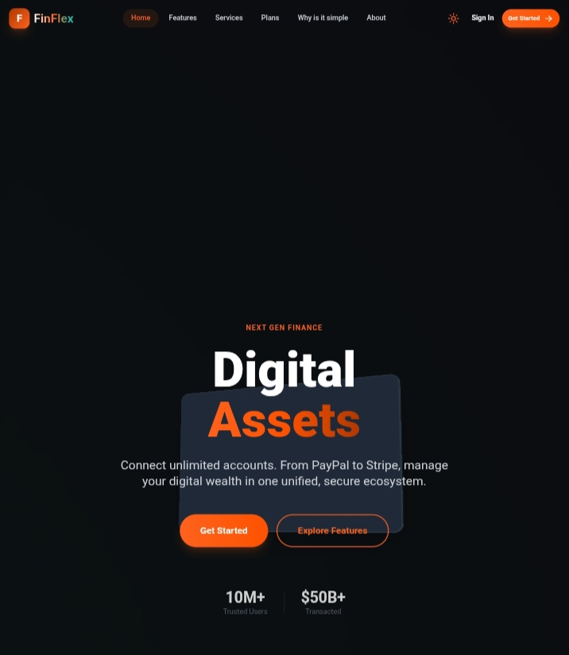

# FinFlex - Modern Financial Infrastructure

**FinFlex** is a cutting-edge financial web platform built with React, TypeScript, and Tailwind CSS. It focuses on delivering a high-performance, aesthetically pleasing user experience through advanced animations, 3D interactions, and glassmorphism design principles.

# Preview


## 🚀 Features

### Core Experience
- **Immersive 3D UI:** Custom-built 3D card components (`TiltedCard`), floating assets, and interactive particle fields.
- **Advanced Animations:** Powered by **Framer Motion**, featuring scroll-triggered reveals, layout transitions, sticky scroll effects, and spring physics.
- **Dark Mode:** Fully responsive system-aware dark theme with seamless transitions.
- **Responsive Design:** Mobile-first architecture ensuring perfect rendering across all devices.

### Pages & Modules
- **Home:** Features a 3D rotating hero card, infinite logo carousel, dynamic pricing tiers, and swinging testimonial cards.
- **Features:** Parallax mouse movement effects, floating 3D elements, and detailed feature breakdowns.
- **Services:** Spotlight hover effects on cards and a 3D interactive mobile phone simulation.
- **Plans:** Particle canvas background, comprehensive comparison tables, and value proposition cards.
- **Simple:** A "Sticky Scroll" storytelling experience where the UI morphs as the user reads.
- **Authentication & Payment:** A unified Sign In/Sign Up flow that transitions into a **Simulated Payment Gateway** with realistic credit card interactions and state management.

## 🛠️ Tech Stack

- **Framework:** [React 19](https://react.dev/)
- **Language:** [TypeScript](https://www.typescriptlang.org/)
- **Styling:** [Tailwind CSS](https://tailwindcss.com/)
- **Animations:** [Framer Motion](https://www.framer.com/motion/)
- **Routing:** [React Router DOM](https://reactrouter.com/)
- **Icons:** [Lucide React](https://lucide.dev/)
- **Utilities:** `clsx`, `tailwind-merge`

## 📂 Project Structure

```
/
├── components/
│   ├── Home/           # Hero, Pricing, Testimonials, Carousel
│   ├── Layout/         # Navbar, Footer
│   └── ui/             # Reusable UI (Buttons, Spotlight, TiltedCard, etc.)
├── lib/
│   └── utils.ts        # CN utility for class merging
├── pages/
│   ├── About.tsx       # Team & History
│   ├── Features.tsx    # Product deep dive
│   ├── Home.tsx        # Landing page
│   ├── Plans.tsx       # Pricing & Comparison (Particle effects)
│   ├── Services.tsx    # 3D interactive services
│   ├── SignIn.tsx      # Auth & Payment Gateway simulation
│   └── Simple.tsx      # Sticky scroll storytelling
├── App.tsx             # Main routing
├── index.html          # Entry HTML
└── index.tsx           # Entry point
```

## ⚡ Key Components

### `PaymentGateway` (in `SignIn.tsx`)
A stateful component that simulates a secure checkout process. It accepts plan data via React Router state, allowing users to select a plan on the pricing page and see the correct details at checkout. It features a reactive credit card visualizer that highlights fields as you type.

### `Spotlight` (`components/ui/Spotlight.tsx`)
A wrapper component that tracks mouse movement to create a radial gradient "spotlight" effect on hover, revealing borders or background textures.

### `ParticleField` (in `pages/Plans.tsx`)
A canvas-based component that renders a network of connecting particles, adding depth and motion to the pricing page background without compromising performance.

## 🎨 Design System

FinFlex uses a custom Tailwind configuration to define its brand identity:
- **Brand Colors:**
  - Primary: `#fe621d` (Vibrant Orange)
  - Dark: `#af3800`
  - Charcoal: `#121212` (Dark mode background)
- **Typography:** Roboto (via Google Fonts)

## 📦 Installation

1. **Clone the repository:**
   ```bash
   git clone https://github.com/your-username/finflex.git
   ```

2. **Install dependencies:**
   ```bash
   npm install
   ```

3. **Run the development server:**
   ```bash
   npm start
   # or
   npm run dev
   ```

## 📄 License

This project is open source and available under the [MIT License](LICENSE).

---

Built with ❤️ by the FinFlex Team.
